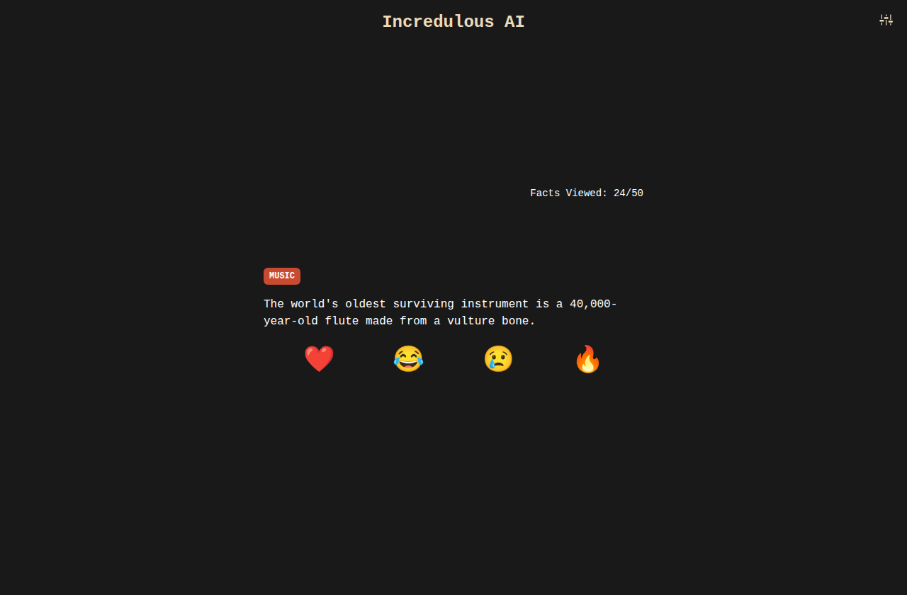
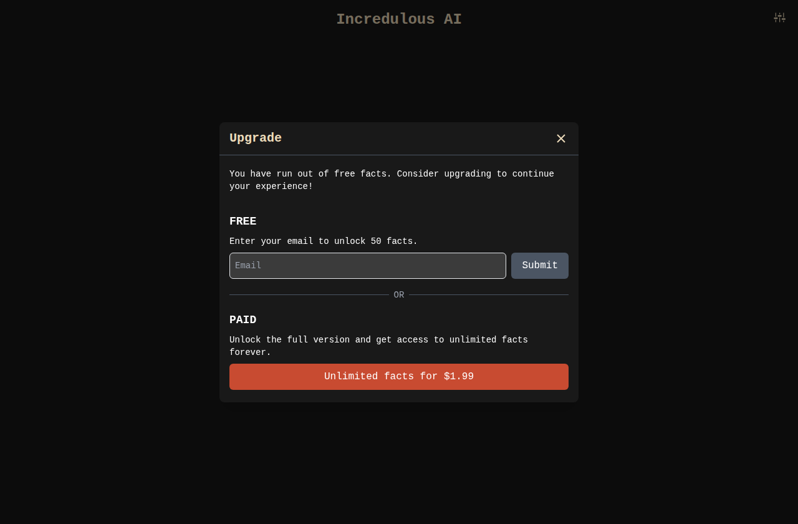
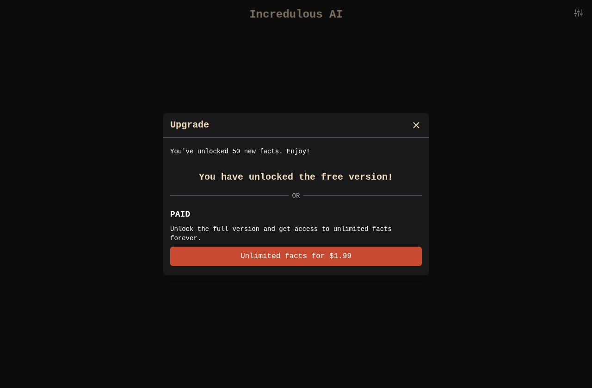

<h1 align="center">Incredulous AI</h1>

<p align="center"><b>AI-powered fact generator delivering daily astonishment — one incredible fact at a time.</b></p>

<p align="center">
  <a href="https://www.incredulous.ai/"></a>
  
  
  
  <a href="LICENSE"></a>
</p>

<p align="center">
  
</p>

## Why Incredulous AI?

The internet is mostly noise. Incredulous AI is a small antidote: open it and you get **one** genuinely surprising fact — react with an emoji, and the next one appears. No feed, no infinite scroll, just a steady drip of _"wait, really?"_

It's a tiny web app that uses OpenAI's API to serve incredulous facts, lets you react to each one, and has a lightweight **pseudo-monetization** flow built in. Facts are generated on demand across ten topics, so the well never runs dry. (They're AI-generated and meant to delight — double-check before you quote one at dinner.)

## Pricing

A deliberately simple, escalating paywall:

| Tier | Unlocks | Price |
| --- | --- | --- |
| **Free** | The first 5 facts | $0, no signup |
| **Email** | 50 facts | Your email address |
| **Paid** | Unlimited facts, forever | $1.99 |

## Screenshots

| Out of free facts | Free version unlocked |
| --- | --- |
|  |  |

## Quick Start

```bash
git clone https://github.com/Monte9/incredulous-ai.git
cd incredulous-ai
yarn

cp .env.example .env.local   # add your OPENAI_API_KEY (see Configuration)
yarn dev
```

Open [localhost:3000](http://localhost:3000) and start reacting. You only need an `OPENAI_API_KEY` to generate facts — Airtable and Mixpanel are optional.

## Features

- **One fact at a time** — a calm, single-card UI instead of an endless feed.
- **Emoji reactions** — ❤️ 😂 😢 🔥 to load the next fact and log how it landed.
- **Ten topics** — Animals, Art, Food, History, Literature, Music, Nature, Science, Space, Sports.
- **On-demand generation** — facts come from OpenAI (`gpt-4o-mini`) as structured JSON.
- **Built-in paywall** — free → email-gated → paid, with signups captured in Airtable.
- **Light & dark mode** — system-aware, with a toggle in Preferences.
- **Optional analytics** — Mixpanel events when a token is configured.

## Tech Stack

- **Framework:** Next.js 14 (Pages Router) · React 18 · TypeScript
- **Styling:** Tailwind CSS
- **AI:** OpenAI API (`gpt-4o-mini`)
- **Data & analytics:** Airtable (signups) · Mixpanel (events)
- **Testing:** Playwright (end-to-end)
- **Tooling:** Husky · lint-staged
- **Deploy:** Vercel

## How it works

The browser asks the server for a fact; the server calls OpenAI and returns clean JSON — the API keys never leave the server.

```
Browser ──POST /api/generateFact?topics=…──▶ Next.js API route ──▶ OpenAI (gpt-4o-mini)
                                                   │
                                        topic allowlist + per-IP rate limit
```

- **`pages/api/generateFact.ts`** picks a random (allow-listed) topic, builds the prompt, and asks OpenAI for a short fact as JSON.
- **`pages/api/subscribe.ts`** writes email signups to Airtable **server-side only**, so the Airtable key is never shipped to the browser.
- Client state (facts viewed, unlocked count, theme) lives in `localStorage`.

See [`AGENTS.md`](AGENTS.md) for the full project map and [`SECURITY.md`](SECURITY.md) for how secrets are handled.

## Configuration

Copy `.env.example` → `.env.local` and fill in what you need:

| Variable                 | Required | Purpose                                   |
| ------------------------ | -------- | ----------------------------------------- |
| `OPENAI_API_KEY`         | Yes      | Generates facts (server-side only)        |
| `AIRTABLE_API_KEY`       | Optional | Stores email signups (server-side only)   |
| `MIXPANEL_PROJECT_TOKEN` | Optional | Client analytics                          |
| `APP_ENV`, `APP_NAME`    | Optional | Environment / analytics tags              |

> Server secrets are read only inside API routes and must **never** be added to the `env` block in `next.config.js` (anything there is inlined into the browser bundle). See [`SECURITY.md`](SECURITY.md).

## Development

```bash
yarn dev          # start the dev server
yarn build        # production build (also runs lint + typecheck)
yarn lint         # ESLint
yarn typecheck    # tsc --noEmit
yarn test:e2e     # Playwright e2e tests (APIs mocked — no keys needed)
```

A Husky `pre-commit` hook runs `lint-staged` + `tsc --noEmit` on every commit. End-to-end tests live in `e2e/`:

```bash
npx playwright install chromium   # one-time
yarn test:e2e
```

## Traction

A small paid-acquisition experiment on Google Ads:

| Metric | Value |
| --- | --- |
| Ad spend | $70 |
| Cost per click (CPC) | $0.06 |
| Cost per activation _(clicked "Buy — $1.99")_ | $4.60 |
| Cost per conversion _(submitted email)_ | $7.00 |

At its peak the site drew **~150 new unique visitors/day** — of whom **~33% interacted** with the app, and **40%+ of those were highly engaged** (4+ facts viewed per visitor).

## Credits

- **[Monte Thakkar](https://github.com/Monte9)** — idea, design, and original build
- **Claude by Anthropic** — security hardening, the test suite, tooling, and this README

## License

[MIT](LICENSE) © Monte Thakkar
